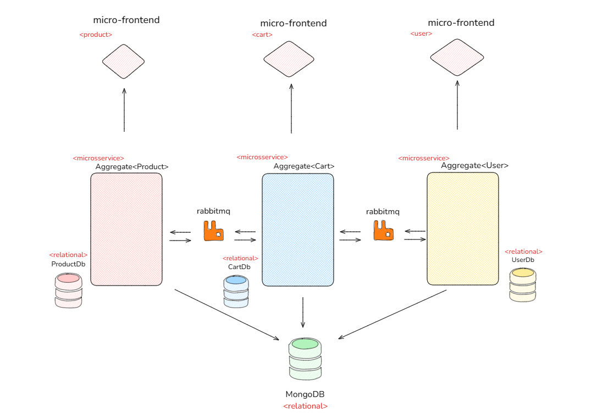

## Requests for Comments (RFCs)

Here, I'll discuss the project's issues and propose long-term improvements. Since this is a prototype, there were many problems I did not address.

First, I want to present my idea through a software architecture diagram. The following RFCs will be based on this structure for the e-commerce product.

### 1. The Monolithic Approach

I noticed that the challenge aimed to test the candidate's ability to model the domain using DDD. However, as I was developing, I questioned whether having all these use cases together was the best approach. 

I believe that a microservices architecture, dividing the system into bounded contexts, would be more beneficial. 

For example, the `Product` aggregate could be a microservice responsible for managing products, while the `Cart` aggregate could be another microservice managing carts. 

Additionally, the frontend could be split into three micro-frontends: `Login`, `ProductList`, and `Checkout`.

As I progressed with the project, I felt that this approach would make future refactorings easier. You can already see some indications of this within the current implementation. 

Of course, I did not implement it this way because it was out of scope. A good intermediate solution would be to refactor the system into a **modular monolith**. Then, whenever horizontal scaling is needed, we could extract modules into microservices as necessary.

### 2. Caching

While developing, I realized that listing products and carts would be a good use case for caching. These data points do not change frequently. 

However, since pagination was implemented, I did not feel an immediate need to add caching. Still, this is an important area to monitor for future optimizations.

### 3. Persisting Domain Events

As you may have noticed, domain events are published to a RabbitMQ queue. However, I believe it is crucial to persist these events at the database level.

Since event data is denormalized, it fits better in a **non-relational database**—which is likely why such a database is included in the `docker-compose` file. 

These stored events could be used by an AI agent or as part of a **CQRS strategy**, where view models are persisted separately from the master data layer.
